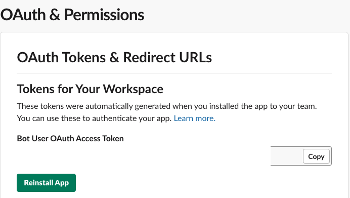
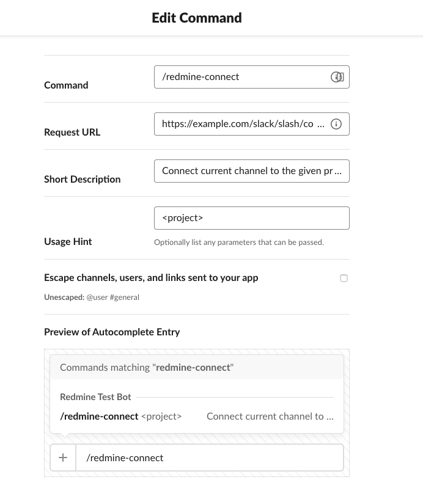

Redmine Slack
=============

This plugin allows to send notifications from your Redmine installation to Slack.

It's heavily inspired by [Redmine Messenger](https://github.com/AlphaNodes/redmine_messenger/) but supporting only Slack. This way, we can take advantage of a lot of rich features included on Slack.

# Configuration

There's a global config and a per-project config to override global values. In this configuration you can set some parameters for the integration.


To configure this plugin you need to get Slack Token and Slack Signing Secret.

## Slack Signing Secret

You get this on Basic Information tab for your app.


## Slack Token

You get this on "OAuth & Permissions" tab for your app.



## Existing configuration parameters

This is a list of current configuration parameters (both in global and per project):

- Slack Token: Configure Slack token
- Slack Signing Secret: Configure Slack Signing Secret to validate requests coming from Slack
- Slack Channel: Channel to send notifications.
- Slack Verify SSL: Configure whether SSL should be validated (Leave on. This will probably be deleted in a future version)
- Auto Mentions: Configure whether to use mentions automatically in Slack.
- Default Mentions: Mentions to include by default in Slack notifications.
- Post Updates: Post issues updates to Slack.
- New Include Description: Include description in new issue.
- Updated include description: Include description in updated issue.
- Text Trim Size: Character amount used to trim notifications to Slack.
- Supress Empty Messages: Avoid sending messages without text description to Slack.
- Post Private issues: Configure whether new private issues should be posted to Slack.
- Post private notes: Configure whether updates to private issues should be posted to Slack.
- Post wiki: Configure whether new Wiki pages should be posted to Slack.
- Post wiki updates: Configure whether updates to wiki pages should be posted to Slack.

## Configuring a new channel

To configure a new channel, you could do one of these options:

1) In Project -> Settings -> Redmine Slack, add channel and click save
2) In Slack channel, invoke slash command like this: `/redmine-connect project-slug`

In order to use as described in number 2), you need to create a Slack Slash command and provide it with the following url: `/slack/slash/connect`

This is an example on how to configure the Slash Command:




## Posting Slack replies to Redmine

This plugin is able to post the threaded replies for a notification back to Redmine. In order to do so, you need to configure a cron job like this:

```
0 * * * * cd /home/redmine/redmine && ./bin/rails runner Slack.post_slack_responses -e production >> log/cron_rake.log 2>&1
```

You should also configure "Get Slack replies threshold" parameter in the global plugin settings to the same amount of seconds between each cron run (e.g. if cron runs once per hour, time replies threshold should be 3600).

# Features

This plugin sends Slack notifications when you update issues or wiki entries.

# Permissions required in Slack

The following scopes are required in order to work properly with Slack:

- chat:write
- chat:write.public
- commands
- files:read
- user:read
- user:read.email
